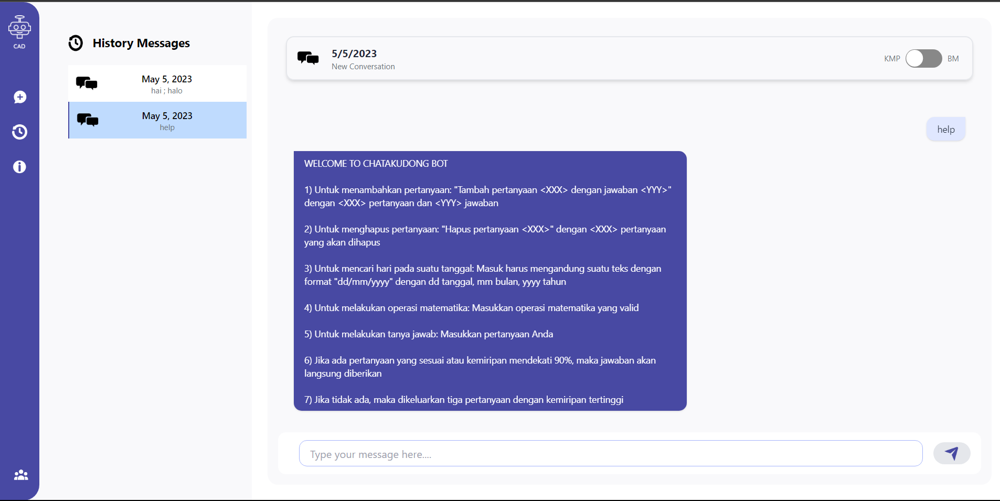

# Tubes3_ChatAkuDong_FE
> Tugas Besar 3 IF2211 - Strategi Algoritma
> Live demo [_here_](https://www.youtube.com/watch?v=OcAE0r-t8uI&feature=youtu.be).

## Table of Contents
* [General Info](#general-information)
* [Technologies Used](#technologies-used)
* [Features](#features)
* [Screenshots](#screenshots)
* [Setup](#setup)
* [Acknowledgements](#acknowledgements)


## General Information
Dalam tugas besar ini, kami diminta untuk membangun sebuah aplikasi ChatGPT sederhana dengan mengaplikasikan pendekatan QA yang paling sederhana tersebut. Pencarian pertanyaan yang paling mirip dengan pertanyaan yang diberikan pengguna dilakukan dengan algoritma pencocokan string Knuth-Morris-Pratt (KMP) dan Boyer-Moore (BM). Regex digunakan untuk menentukan format dari pertanyaan (akan dijelaskan lebih lanjut pada bagian fitur aplikasi). Jika tidak ada satupun pertanyaan pada database yang exact match dengan pertanyaan pengguna melalui algoritma KMP ataupun BM, maka gunakan pertanyaan termirip dengan kesamaan setidaknya 90% Apabila tidak ada pertanyaan yang kemiripannya di atas 90%, maka chatbot akan memberikan maksimum 3 pilihan pertanyaan yang paling mirip untuk dipilih oleh pengguna.


## Technologies Used
- Typescript
- Tailwind CSS
- React

## Features
List the ready features here:
- Simple Arithmetic Calculator
- Day and Date Calculator
- Simple Chatbot (with KMP, BM, and Regex)

## Setup
1. To run locally, make sure you have node and npm installed on your machine. Check [_here_](https://nodejs.org/en/download/) to install node and npm.
2. Clone this repository.
```
git clone github.com/IceTeaXXD/Tubes3_ChatAkuDong_FE.git
```
3. Install all dependencies
```
cd src
npm install
```
4. Run the program
```
cd src
npm start
```
5. Open your browser and go to http://localhost:3000/

## Screenshots

<br>


## Acknowledgements
- Tuhan Yang Maha Esa
- Dosen Pengampu Mata Kuliah IF2211 Strategi Algoritma
- Asisten Pengampu Mata Kuliah IF2211 Strategi Algoritma
- Our loved ones who support us to finish this project 💖